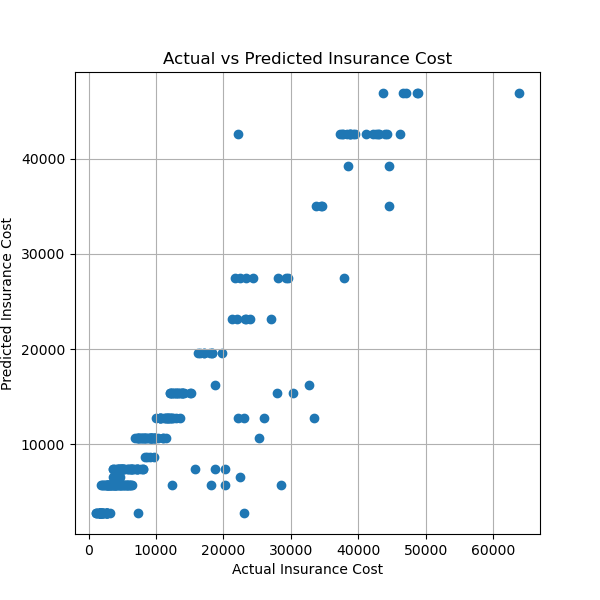

# 🏥 Medical Insurance Cost Prediction using Decision Tree Regression

## 📌 Project Overview

This project predicts individual medical insurance charges using **Decision Tree Regression**. The model was trained on a dataset containing demographic and health-related information such as age, sex, BMI, number of children, smoking status, and region.

---

## 📂 Dataset

The dataset contains information about insurance policyholders, including:

* Age
* Sex
* BMI
* Children
* Smoker
* Region

**Target Variable:**

* Charges

---

## 🛠️ Technologies Used

* Python
* Pandas
* Matplotlib
* Scikit-learn
* Jupyter Notebook

---

## 🔄 Project Workflow

* Data Loading
* Data Exploration
* Data Preprocessing
* Feature & Target Selection
* Train-Test Split
* Decision Tree Regression Model
* Model Training
* Prediction
* Model Evaluation
* Feature Importance Analysis
* Actual vs Predicted Visualization

---

## 📊 Model Performance

| Metric                    |            Value |
| ------------------------- | ---------------: |
| R² Score                  |     **0.8641** |
| Mean Absolute Error (MAE) |  **2697.77** |
| Mean Squared Error (MSE)  | **21093484.00** |

---

## 📈 Actual vs Predicted Charges

---

## 📌 Conclusion

The Decision Tree Regression model achieved an **R² Score of 0.8641**, explaining approximately **86%** of the variation in medical insurance charges. The model produced an **MAE of 2697.77** and an **MSE of 21093484.00**, demonstrating strong predictive performance on the dataset.

---

## 🚀 Future Improvements

* Tune Hyperparameters
* Perform Cross Validation
* Compare with Random Forest Regression
* Compare with advanced regression models such as XGBoost.
